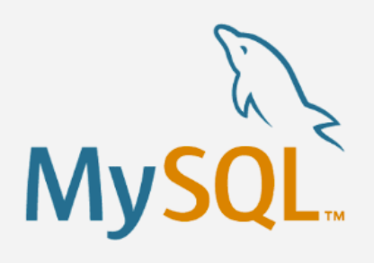
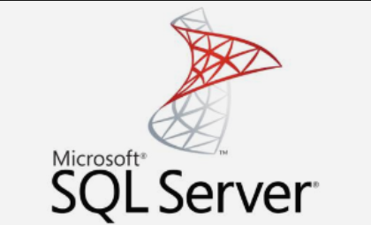
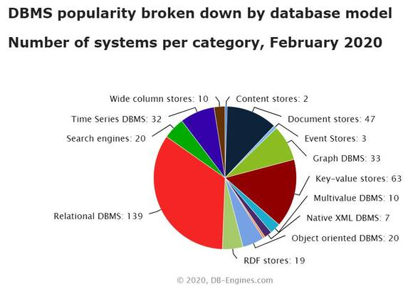
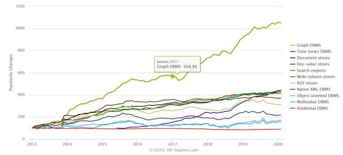

## 데이터베이스 관리 시스템 (DBMS)이란?
데이터 베이스 관리 시스템은 데이터베이스를 조작하는 별도의 소프트웨어로, DBMS를 통해 데이터베이스를 관리하여 응용 프로그램들이 데이터베이스를 공유하고, 사용할 수 있는 환경을 제공한다. DBMS는 데이터베이스를 구축하는 틀을 제공하고, 효율적으로 데이터를 검색하고 저장하는 기능을 제공한다. 
또한 응용 프로그램들이 데이터베이스에 접근할 수 있는 인터페이스를 제공하고, 장애에 대한 복구 기능, 사용자 권한에 따른 보안성 유지 기능 등을 제공한다. 즉, 데이터베이스 내의 정보를 구성하는 컴퓨터 프로그램의 집합으로서, 자료의 중복성을 제거하고 다른 특징들 중에 무결성, 일관성, 유용성을 보장하기 위해서 자료를 제거하고 관리하는 소프트웨어 체계이다.

## 대표적인 DBMS
### 1. Oracle

- Oracle 사에서 개발되었으며, 현재 가장 널리 사용되는 RDBMS. 
- 운영체제 관계 없이 설치가 용이하다. 
- 보안성이 높아 제조업, 금융권 등의 대기업에서 널리 사용된다. 
- 오픈소스가 아니라는 단점이 있으나, 그로 인해 보안성이 높다.
- MySQL, MSSQL보다 대량의 데이터 처리에 용이하다.

### 2. MySQL

- MySQL AB사에서 개발, 썬 마이크로시스템즈를 거쳐 Oracle이 인수 합병 했다.
- 운영체제 관계 없이 설치가 용이하다.
오픈소스로 이루어진 무료프로그램이지만, 성업적 이용시 비용이 발생한다.
- Oracle에 비해 비용적 장점이 있어 중소기업에서 많이 사용된다.
- 오픈소스에 호의적이지 않은 Oracle에 합병됨에 따라 추후 MariaDB의 모태가 된다.

### 3. MS-SQL

- Microsoft에서 개발한 상업용 DB
- 운영체제에서 구애받지 않지만 windows에 특장점을 보이고 있다. 
- windows 버전은 소스 비공개, linux 버전은 오픈소스
- 금융권에서도 조금씩 사용되는 것을 봤으나 중소기업 위주로 사용한다.

### 4. Maria DB

- MySQL이 Oracle에 합병된 후 불확실한 라이선스 문제를 해결하려고 나온 오픈소스 RDBMS
- 구현 언어는 C++
- 운영체제에 관계 없이 설치가 용이하다.
-기존 MySQL 드라이버 호환이 완벽하며, 그 외의 기능도 제공한다.
- 중소 기업 및 개인 프로젝트에서의 활용도가 탁월하다.
- MySQL과 비교해 어플리케이션 부분 속도가 약 4~5천배 정도 빠르다.

## 대표적인 DBMS의 최신 버전
### 1. Oracle - Oracle 21c
- **블록체인 기술 지원** : 불변적인 블록체인 테이블을 통해 블록체인 기술의 주요 보안 이즘을 Enterprise Application에도 활용할 수 있도록 한다.
오라클 암호 보안 데이터 관리의 일환인 블록체인 테이블은 각 행이 암호화된 방식으로 연결되어 불변성의 특성을 갖게 된다.
Oracle DB 내에서 변조 감지 및 방지 기능을 즉시 활용
=> 내부자/해커의 불법적인 시스템 변경 방지

- **JSON 저장 및 JavaScript 실행 지원** : 기존 버전 대비 10배 빠른 스캔과 최대 4배 빠른 업데이트 작업을 가능하게 하는 새로운 JSON 데이터 유형이 추가되었다.

- **AutoML** : 대규모 기계 학습 모델을 자동으로 구축/비교 -> 비 전문가도 머신러닝을 쉽게 사용하도록 지원한다.
DB내에서 널리 활용되는 머신러닝 알고리즘을 수집하는 방대한 라이브러리에 이상 탐지, 회귀 분석 및 딥러닝 분석을 위한 알고리즘 새롭게 추가한다.

### 2. MySQL - MySQL 8.0
- **데이터 딕셔너리 업그레이드** : MySQL 5.7 버전까지는 데이터 딕셔너리 정보가 FRM 확장자를 가진 파일로 별도로 보관됐었는데, MySQL 8.0 버전부터는 데이터 딕셔너리 정보가 트랜잭션이 지원되는 InnoDB 테이블로 저장되도록 개선됐다. 데이터 딕셔너리 업그레이드는 기존의 FRM 파일의 내용을 InnoDB 시스템 테이블로 저장한다. MySQL 8.0 버전부터는 딕셔너리 데이터의 버전 간 호환성 관리를 위해 테이블이 생성될 때 사용된 MySQL 서버의 버전 정보도 함께 기록한다.

- **서버 업그레이드** : MySQL 서버의 시스템 데이터베이스(performance_schema와 information_schema, 그리고 mysql 데이터베이스)의 테이블 구조를 MySQL 8.0 버전에 맞게 변경한다.

### 3. MS-SQL - SQL Server 2019

### 4. Maria DB - Maria DB 10.0
#### 개선 / 변경 사항
- **Atomic DDL** : DDL(Data Definition Language) 작업 중 서버가 비정상 종료될 경우 이전 버전에서는 작업에 대한 안전 보장이 없었다. 10.6 버전부터는 CREATE TABLE, ALTER TABLE, RENAME TABLE, DROP TABLE, DROP DATABASE 및 관련 DDL 문은 비정상 종료에 안전하도록 개선되었다. MariaDB의 Atomic DDL은 비정상 종료하면 DDL문이 완전히 실행되거나 전혀 수행되지 않는다. 이는 비정상 종료가 발생하여 서버를 다시 시작하더라도 모든 테이블이 일관되고 바이너리 로그가 서버의 상태와 일치함을 뜻한다.
또한 Atomic DDL은 데이터베이스 계층에서 구현되어 MariaDB의 다양한 스토리지 엔진과 함께 작동 가능하다. 추후에는 S3 storage engine, partitioning engine도 지원할 예정이다.

- **INNODB** : row_format=COMPRESSED 형식의 테이블은 기본적으로 읽기 전용으로만 사용이 가능하다. 향후 쓰기 지원을 제거하고 더 이상 사용하지 않을 예정이다. 하지만 변수 innodb_read_only_compressed=OFF를 사용하면 쓰기가 가능하다.

InnoDB 임시 테이블 스페이스의 쓰기는 피해야 한다. 페이지가 버퍼 풀(Buffer pool)에서 제거되고 재사용 되지 않는 한 쓰기는 사용하지 않아야 성능에 좋다.

InnoDB Bulk Insert시 속도를 최적화한다. 트랜잭션이 커밋(Commit) 또는 롤백(Rollback) 상태 이거나 INSERT 작업에 영향을 주는 롤백일 때 유지될 exclusive table lock으로 빈 테이블 또는 파티션에 대한 삽입을 커버하여 Insert시 빠른 속도로 처리가 가능하다.

- **사용하지 못하는 변수** : 갈레라 클러스터(Galera Cluster) 관련 변수중 다음 변수는 사용하지 않고 wsrep_mode로 대체하여 사용한다.

|Option|Reaon|
|---|---|
|wsrep_replicate_myisam|wsrep_mode 값 중 REPLICATE_MYISAM 선택하여 사용 가능|
|wsrep_strict_ddl|wsrep_mode 값 중 STRICT_REPLICATION 선택하여 사용 가능|

- **문자셋(Character Sets) 변경** : 문자셋이 utf8에서 utf8m3으로 변경되었다. 3바이트 문자 집합의 기본 이름이 utf8에서 utf8m3으로 바뀐다. 모든 SHOW 및 INFORMATION_SCHEMA 출력은 utf8이 아닌 utf8mb3로 표시된다.

|Option|Old default value|New default value|
|---|---|---|
|character_set_client|utf8|utf8mb3|
|character_set_connection|utf8|utf8mb3|
|character_set_results|utf8|utf8mb3|
|character_set_system|utf8|utf8mb3|

- **시스템 변수 기본값 변경** : 메모리의 버퍼 풀과 OS캐시에 중복 저장되는 더블 버퍼링을 막아 메모리를 효율적으로 사용할 수 있는 O_DIRECT를 기본값으로 채택하였다.

|Option|Old default value|New default value|
|---|---|---|
|innodb_flush_method|fsync|O_DIRECT|

#### 추가 사항
- **추가된 변수** 
|Variable|Explanation|
|---|---|
|binlog_expire_logs_seconds|- 0이 아닌 경우 바이너리 로그를 값(초) 후에 로그 파일을 제거한다. expire_logs_days는 하나를 변경하면 다른 하나가 자동으로 변경되는 별칭의 형태이다.|
|nodb_deadlock_report|- ON: deadlock상태를 보고하는 방법이다.
- **Off**: deadlock 상세정보를 보고하지 않는다.
- **Basic**: 트랜잭션 및 대기 잠금을 보고한다.
- **Full**: 기본값으로 트랜잭션, 대기 잠금 및 차단 잠금을 보고한다.
|innodb_read_only_compressed|- ON일 경우 ROW_FORMAT=COMPRESSED 테이블은 읽기 전용이며, OFF시에는 쓰기를 허용한다.|
|wsrep_mode|wsrep 기능을 사용한다.
(INLOG_ROW_FORMAT_ONLY, DISALLOW_LOCAL_GTID, REQUIRED_PRIMARY_KEY, REPLICATE_ARIA, REPLICATE_MYISAM and STRICT_REPLICATION)|
|Innodb_buffer_pool_pages_lru_freed|플러시하지 않고 버퍼 풀 LRU 축출 스캔에 의해 해제된 페이지 수를 모니터링한다.

- **예약어 추가** : 예약어에 OFFSET이 추가되었고 인용부호(쌍따옴표)가 없으면 식별자로 사용할 수 없다. 10.6버전부터는 INFORMATION_SCHEMA.KEYWORDS를 통해 예약어를 확인할 수 있다.

- **SQL 구문**
    - Select…Skip Locked 구문은 lock이 걸린 행은 결과에서 제외된다. InnoDB 테이블에서만 구현이 가능하다.
    ```SQL
    SELECT [FOR UPDATE|LOCK IN SHARED MODE] SKIP LOCKED
    ```

    - Select…Offset Fetch 구문은 Offset절을 사용하면 지정된 Offset 뒤에 오는 결과 집합만 조회가 가능하다. Fetch절은 반환할 행의 수를 지정한다.
    ```SQL
    OFFSET start { ROW | ROWS }
    FETCH { FIRST | NEXT } [ count ] { ROW | ROWS } { ONLY | WITH TIES }
    ```

    - INDEX IGNORED는 표시되고 유지되지만 옵티마이저에서 사용되지 않는 인덱스로 Mysql 8의 invisible indexes와 유사한 기능이다. 해당 인덱스는 인덱스 제거 여부를 고려할 때 Ignore 처리하여 DB 영향 및 문제가 발생하는 것을 확인할 수 있어 인덱스를 안전하게 삭제할 수 있다. 인덱스 Ignore 여부는 information_schema.statistics Table과 Show INDEX에서 확인하면 된다.
    ```SQL
    IGNORE INDEX [{FOR {JOIN|ORDER BY|GROUP BY}] ([index_list])
    ```

    - JSON_TABLE 구문을 사용할 수 있다. JSON Path 표현식을 기반으로 JSON 데이터를 추출하고 이를 관계형 테이블로 반환하는데 사용하는 구문으로 Select문의 from절 및 다중 테이블 Updata·Delete문에서 테이블을 참조하여 사용한다.

## 회사에서 사용하는 DBMS 종류

DBMS 분야는 최근 ‘오라클’로 대변되던 관계형 DB(RDBMS) 시장에서 벗어나 다양화되고 있다. 이 추세는 최근 몇 년 간 지속되고 있으며, 향후 한 기업이 다양한 DB를 사용하는 것이 대세가 되고 있다.

특히 데이터의 폭증에 따라 기존의 표 기반 데이터베이스(SQL)보다 유연한 NoSQL DB가 주목받고 있다. 분산형 데이터 처리에 NoSQL의 데이터 구조는 키-값(Key-value), 도큐먼트(Document), 와이드 컬럼(Wide column), 객체 기반(Object oriented), 시계열(Time Series), 그래프(Graph) 등 다양하다.

실제 DB의 인기도를 측정하는 DB-엔진닷컴에 따르면, 2020년 2월 기준 서로 다른 350개의 DBMS가 존재한다. 가장 많은 수는 여전히 관계형 DBMS이지만 키-값, 다큐먼트, 그래프, 시계열, 와이드 컬럼 등 다양한 유형의 DB가 인기를 끌고 있는 것을 볼 수 있다.


2013년부터 2020년까지 DB 인기도 트렌드를 살펴보면, 그래프DB와 시계열, 다큐먼트 DB 등의 인기가 부쩍 높아진 것을 볼 수 있다.

시장조사기관 등에 따르면 일반적으로 그래프DB는 유사성 계산이나 부정행위 감지, 연동 구조 평가에 심층 관계 분석 등에 활용되며, 키-값 DB는 특정 애플리케이션에서 마이크로서비스나 여러 프로세스가 데이터를 반영구적으로 공유하는 작업, 신속하게 많은 데이터를 수집·분석하는 용도로는 와이드 컬럼 등이 선호되고 있다.

예를 들어 현재 가장 있기 있는 NoSQL DB인 몽고DB의 경우, 다큐먼트 DB로 다큐먼트와 다른 종류의 데이터 세트 저장, 처리, 액세스에 최적화 됐다. 사용하기 쉽고, 리소스를 많이 요구하는 애플리케이션에 맞춰 확장할 수 있어 개발자 사이에 인기가 높다. 몽고DB는 개인화나 실시간 분석, IoT, 빅데이터, 보안 및 부정행위 방지, 소셜 및 협업 애플리케이션 등 다양한 용도로 활용되고 있다.

국내 기업에서 많이 사용하는 데이터베이스는 Oracle, Microsoft SQL Server, DB2 등의 상용 DBMS이다. DB-engines라는 DBMS 인기도 조사 사이트에 의하면 시장에서 인기 있는 오픈소스 DBMS는 MySQL, PostgreSQL 그리고 NoSQL DBMS인 MongoDB입니다.